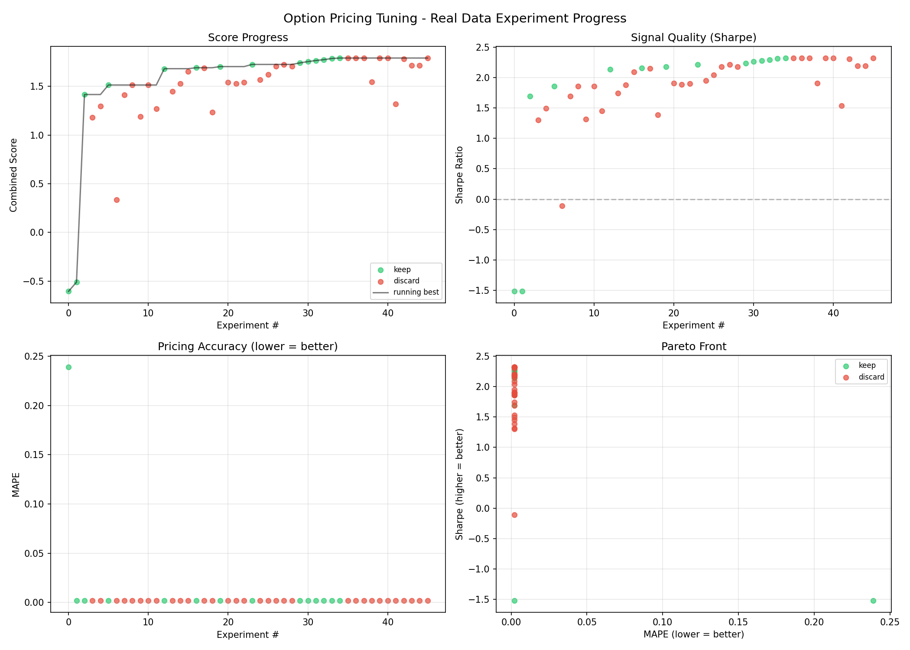

# Option Pricing Tuning

Autonomous AI-driven optimization of options pricing models and CFD trading
signals using **real stock market data** from Yahoo Finance.

## Latest Results



| Metric | Value |
|---|---|
| Combined Score | 1.7916 |
| Sharpe Ratio | 2.3207 |
| MAPE | 0.002026 |
| Win Rate | 84.2% |
| Trades | 19 |
| Experiments | 46 (14 kept) |

## How It Works

An AI agent (Claude) runs an experiment loop:

1. Edits `price.py` with a new idea (better vol surface, smarter signals, etc.)
2. Runs the model against **real stock prices** (SPY, QQQ, AAPL, MSFT, NVDA, TSLA, etc.)
3. Measures **pricing accuracy** (MAPE vs ground truth) and **CFD signal quality** (Sharpe ratio)
4. Keeps improvements, discards regressions, loops

## Data

- **20 real US stocks** from Yahoo Finance (~2 years of daily prices)
- Synthetic options generated on real prices with realistic vol surfaces
- CFD simulation with Trading 212 costs (0.1% spread, ~3% annual overnight financing)

## Scoring

```
combined_score = 0.4 * pricing_score + 0.6 * signal_score
```

- **pricing_score** = `max(0, 1 - MAPE)` - accuracy vs ground truth option prices
- **signal_score** = annualized Sharpe ratio of simulated CFD trades
